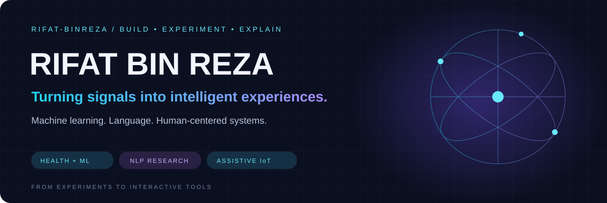

<h1 align="center">Hi, I'm Rifat 👋</h1>
<h3 align="center">Electrical Engineer · Research Assistant · Applied ML Researcher</h3>

<b>From physiological signals to wireless intelligence.</b> Building data-driven methods and practical systems for real-world engineering.

---

## 🧬 About me

I'm an **Electrical and Electronic Engineering graduate from BRAC University**, currently working as a **Research Assistant at BRAC University**. My research connects **biomedical signal processing, applied machine learning, medical imaging, and wireless communications**.

- 🫀 **Current focus:** smartphone-based photoplethysmography (PPG), motion-aware modelling, signal quality, and robust physiological estimation.
- 📡 **Wireless research:** mmWave beam prediction, SNR modelling, and explainable / physics-informed machine learning.
- 🧠 **Medical AI:** brain MRI data, tumor segmentation, synthetic data augmentation, and interpretable health prediction.
- 🦾 **Hands-on engineering:** ESP32 systems, assistive interfaces, PCB design, and power electronics.
- ⚛️ **Additional research:** first-principles modelling and optical properties of lead-free perovskites.

<b>SIGNALS → MODELS → EXPLANATIONS → SYSTEMS</b>

## 🔭 Research directions

| 🫀 Biomedical intelligence | 📡 Wireless intelligence | 🦾 Human-centered hardware |
| :--- | :--- | :--- |
| PPG · physiological estimation · MRI · explainable health ML | mmWave · beam prediction · antenna-informed modelling · multimodal sensing | Assistive control · ESP32 · IoT telemetry · embedded sensing |

## 🚀 Featured projects

### 🫀 MoWaveQFormer · Smartphone PPG research

**Motion-conditioned filters × quality-gated Transformer.** Research notebook, recorded experiments, baseline comparisons, and reproducibility notes for our smartphone PPG heart-rate estimation work.

[Explore the repository →](https://github.com/rifat-binreza/MoWaveQFormer) · [Read the preprint ↗](https://arxiv.org/abs/2609.16248)

<table>
<tr>
<td width="50%" valign="top">
<h3>📡 Multimodal Beam Prediction</h3>

<b>First-author research · Vision + position + temporal learning.</b>

I am the first author of the related submitted manuscript. This project explores camera and positional sensing for beam prediction, including ConvNeXt, cross-attention, LSTM, and tabular-model experiments.

<code>PyTorch</code> <code>Computer Vision</code> <code>Wireless ML</code>

<b>Manuscript submitted</b> to IEEE Transactions on Vehicular Technology.

<a href="https://github.com/rifat-binreza/beam-prediction"><b>Explore my research fork →</b></a> 
Forked from <a href="https://github.com/shovo896/beam-prediction">shovo896/beam-prediction</a>; upstream authorship and history preserved.
</td>
<td width="50%" valign="top">
<h3>🦾 PsychMatrix</h3>

<b>Gesture-based assistive control.</b>

My thesis project connects dual-ESP32 hardware, Firebase telemetry, and a React Native / Expo interface to support home-device control.

<code>ESP32</code> <code>Firebase</code> <code>React Native</code>

<a href="https://github.com/rifat-binreza/PSYCHMATRIX-EMPOWERING-USERS-THROUGH-ADVANCED-INTERACTIVE-CONTROL"><b>Explore the system →</b></a>
</td>
</tr>
<tr>
<td width="50%" valign="top">
<h3>🌙 Sleep Intelligence Lab</h3>

<b>Interpretable health-data experiments.</b>

Sleep-disorder classification using lifestyle and biometric signals, ensemble learning, feature engineering, and an interactive Gradio workspace.

<code>scikit-learn</code> <code>LightGBM</code> <code>Gradio</code>

<a href="https://github.com/rifat-binreza/sleep_data_analysis_bracu"><b>Explore the lab →</b></a>
</td>
<td width="50%" valign="top">
<h3>💬 ALTA 2026 · Language Understanding</h3>

<b>Sentiment and sarcasm across varieties.</b>

Reproducible classification baselines and evaluation tooling for Australian and British English using the BESSTIE benchmark.

<code>Python</code> <code>NLP</code> <code>TF-IDF</code>

<a href="https://github.com/rifat-binreza/2026_ALTA_RIFAT"><b>Explore the experiments →</b></a>
</td>
</tr>
</table>

## 📚 Research & publications

### Conference work

- **Brain tumor detection with U-Net, Xception, and LoRA-driven synthetic augmentation** — IEEE IICAIET 2025. [NeuroVista MRI · code & research](https://github.com/rifat-binreza/NeuroVista-MRI) · [IEEE paper](https://doi.org/10.1109/IICAIET67254.2025.11264978).
- **Explainable AI for SNR prediction and adaptive beamforming in mmWave 5G networks** — IEEE ICCIT 2025.
- **TRP Monitoring on Analog Cable with IoT** — IEEE QPAIN 2025. [Paper](https://ieeexplore.ieee.org/document/11171871).

### Preprints, submissions & ongoing work

| Work | Status / resource |
| :--- | :--- |
| **MoWaveQFormer** — motion-conditioned, quality-gated smartphone PPG heart-rate estimation | [arXiv preprint](https://arxiv.org/abs/2609.16248) · [Code & experiments](https://github.com/rifat-binreza/MoWaveQFormer) |
| **Multimodal beam prediction** — first-author vision and position research | Manuscript submitted to **IEEE Transactions on Vehicular Technology** |
| **BIOSE brain MRI dataset** — BIDS-compliant imaging data and research data coordination | [Mendeley Data](https://doi.org/10.17632/9mcp5pbtbr.2) · Data in Brief manuscript under review |
| **LiSrI₃ under pressure** — electronic, optical, and mechanical properties | Computational materials research |
| **Explainable ensemble learning for depression prediction** | BIM 2025 / Taylor & Francis book-chapter work |

<a href="https://scholar.google.com/citations?user=U7HsBd4AAAAJ&hl=en"><b>Browse my research on Google Scholar ↗</b></a>

## 🛠 Research & engineering toolkit

**Machine learning & medical imaging**

**Signals, hardware & scientific computing**

**Interfaces & reproducible research**

<b>More methods and tools</b>

- **Learning & explainability:** CNNs, U-Net, Xception, LoRA, transfer learning, SHAP, LIME, SMOTE, and ADASYN.
- **Biomedical data:** MRI, DICOM-to-NIfTI workflows, BIDS validation, EEG acquisition, and PPG signal-quality analysis.
- **Electrical design:** AutoCAD Electrical, EasyEDA, Proteus, LTspice, PSpice, ETAP, and PVSyst.
- **Research workflow:** Google Colab, Hugging Face Spaces, Mendeley, Zotero, and scientific reporting.

## 🧭 My path

| When | Role |
| :--- | :--- |
| **Aug 2026–present** | Research Assistant · **BRAC University** — biomedical signals and ML |
| **Apr–Jul 2026** | Electrical Engineer · **Saheda Consulting** — electrical design and technical review |
| **Dec 2025–Feb 2026** | Medical Imaging & Data Management Intern · **TeleRad Medical Systems** |
| **May 2024–Jul 2025** | Undergraduate Researcher · **BIOSE, BRAC University** — MRI datasets and biomedical hardware |
| **Mar–Oct 2023** | Electronics / Power Team Member · **BRACU Mongol Tori & BRACU Duburi** |

🎓 **B.Sc. in Electrical and Electronic Engineering**, BRAC University · 2021–2025  
🏅 University Merit Scholarship · **IEEE member**, EMBS & PES

## 🤝 Let's connect

I'm interested in research collaborations in **biomedical AI, signal processing, explainable ML, wireless intelligence, and assistive technology**.

<b>Engineering grounded in signals. Research driven by curiosity.</b> Dhaka, Bangladesh · Biomedical AI × Wireless ML × Embedded Systems

